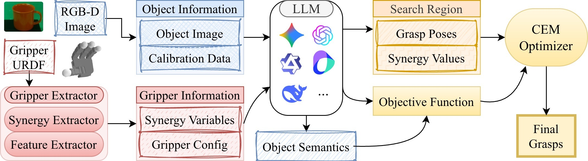

<div align="center">

# Ask Professor G. How to Grasp

### Training-Free Cross-Gripper Grasping from an RGB-D Observation and a Gripper URDF

Wanhao Niu<sup>*</sup>, Yuan Sun<sup>*</sup>, Qiyan Ke, Jie Xu, Hao Sun, Muyuan Ma, Fuchun Sun<sup>&dagger;</sup>

[](https://sunyuan1111.github.io/ASK-Professor-G-How-to-Grasp/)
[](docs/assets/ask-professor-g-paper.pdf)
[](#quick-start)
[](LICENSE)

**Project page:** <https://sunyuan1111.github.io/ASK-Professor-G-How-to-Grasp/>

</div>

## News

- **2026-06**: We release the cleaned public reproduction code for the core ASK Professor G pipeline.
- **2026-06**: Added an offline cached demo with Stage 0 visual proposals, RGB-D geometry verification, CEM optimization, and mesh/OBJ visualizations.
- **2026-06**: Added optional PyRender support for paper-aligned RGB-D rendering and 2D-to-3D lifting.

## Overview

ASK Professor G is a training-free grasp synthesis framework for heterogeneous grippers. Given a single RGB-D observation and a gripper URDF, the system asks a foundation model to propose semantic visual grasp regions, verifies them geometrically in 3D, expands valid regions into pose-synergy search boxes, compiles an executable objective, and refines the final grasp with Cross-Entropy Method optimization.

This repository is the cleaned public core of the IROS codebase. It focuses on the reproducible method path and intentionally leaves out baselines, ablations, MuJoCo batch evaluation, GUI tools, and real-robot control scripts.

<div align="center">
  
</div>

## Highlights

- **Training-free cross-gripper grasping**: no gripper-specific retraining is required when switching to a new URDF-specified end-effector.
- **Semantic visual proposals**: Stage 0 predicts graspable 2D regions directly on the RGB observation instead of producing final poses.
- **RGB-D geometry audit**: candidate pixels are lifted into 3D using depth and camera calibration, then checked with local geometry and gripper width constraints.
- **Objective compilation**: Stage 2 produces a `calculate_loss(pose_mat, point_cloud) -> float` function with target, contact, collision/clearance, orientation, and semantic-priority terms.
- **CEM refinement**: final grasps are optimized in a unified pose-synergy state space.
- **Offline reproducibility**: a cached demo runs without any online LLM API key.

## Method Pipeline

```text
RGB-D observation + gripper URDF
  -> Stage 0: visual semantic 2D grasp proposals
  -> 2D-to-3D geometry probing and validation
  -> Stage 1: pose-synergy search region generation
  -> Stage 2: executable loss function generation or cached loss loading
  -> Stage 3: CEM optimization
  -> ranked grasp results + visualizations
```

The standard run directory contains the intermediate evidence chain:

```text
runs/{timestamp}_{gripper}_{object}/
  render/
    view_front_iso_rgb.png
    view_front_iso_depth.npy
    view_front_iso_camera.json
    render_metadata.json
  stage0_output.json
  geometry_probing_results.json
  stage1_output.json
  stage1_output_processed.json
  step2_loss.py
  step3_output.json
  visualizations/
    stage0_2d_points.png
    stage0_3d_validation.png
    grasp_points_visualization.png
    final_grasp_render.png
    final_grasp_diagnostics.png
    optimization_overview.png
    obj_scene/
      stage0_grasp_points.obj
      optimized_grasps.obj
```

## Visualization

The public pipeline writes both image and OBJ evidence for debugging and paper-style inspection.

| Stage | Output | Description |
| --- | --- | --- |
| Stage 0 | `visualizations/stage0_2d_points.png` | VLM 2D candidate points drawn on the RGB observation. |
| Geometry | `visualizations/stage0_3d_validation.png` | Validated 3D candidates projected back to the observation with measured widths. |
| Geometry | `visualizations/grasp_points_visualization.png` | Object mesh rendered with lifted 3D grasp points and local normals. |
| Final grasp | `visualizations/final_grasp_render.png` | Best CEM grasp rendered with an object mesh and WSG-style gripper proxy. |
| Final grasp | `visualizations/final_grasp_diagnostics.png` | XY/XZ/YZ diagnostic projections with opening, target-distance, and surface-distance checks. |
| Final grasp | `final_grasp_report.json` | Machine-readable sanity report for the best grasp. |
| OBJ | `visualizations/obj_scene/stage0_grasp_points.obj` | Single OBJ scene containing the object mesh and Stage 0 3D markers. |
| CEM | `visualizations/obj_scene/optimized_grasps.obj` | Single OBJ scene containing the object mesh and optimized gripper proxies. |

## Repository Structure

```text
configs/                  YAML configs for grippers, objects, and default runs
data/                     Git LFS-tracked gripper and object assets
docs/                     project-page assets, paper PDF, and media
examples/cached/          offline demo inputs
scripts/run_pipeline.py   main end-to-end entrypoint
scripts/run_cached_demo.py offline smoke demo
src/ask_professor_g/      core package
tests/                    unit and integration tests
```

## Installation

Install Git LFS before pulling the full assets:

```bash
git lfs install
git lfs pull
```

Create a Python environment:

```bash
python -m venv .venv
.venv\Scripts\activate
python -m pip install -U pip
```

Install the offline/test dependencies:

```bash
pip install -e ".[test]"
```

Install the optional rendering and geometry stack for paper-aligned RGB-D rendering:

```bash
pip install -e ".[geometry,render]"
```

Install LLM providers for the full online pipeline:

```bash
pip install -e ".[llm]"
```

If PyRender/OpenGL is unavailable on a machine, the pipeline falls back to a deterministic orthographic renderer. The selected renderer is recorded in `render/render_metadata.json`.

## Quick Start

Run the offline cached demo without any API key:

```bash
python scripts/run_cached_demo.py --run-dir runs/cached_demo
```

Run the default full pipeline:

```bash
python scripts/run_pipeline.py --config configs/default.yaml
```

Override the gripper and object:

```bash
python scripts/run_pipeline.py --gripper wsg_50 --object 3D_Dollhouse_Lamp
```

Run only selected stages:

```bash
python scripts/run_pipeline.py --stages render,stage0,geometry
```

Use cached LLM outputs while still running rendering, geometry probing, and optimization:

```bash
python scripts/run_pipeline.py --cached --example examples/cached
```

## LLM Configuration

No API keys are stored in the repository. Copy `.env.example` to `.env` locally or export environment variables in your shell.

Gemini:

```bash
set GRASP_LLM_PROVIDER=gemini
set GRASP_LLM_MODEL=gemini-3-pro-preview
set GEMINI_API_KEY=...
```

OpenAI-compatible providers:

```bash
set GRASP_LLM_PROVIDER=openai-compatible
set GRASP_LLM_MODEL=gpt-4o
set OPENAI_API_KEY=...
set OPENAI_BASE_URL=https://api.openai.com/v1
```

Any provider exposing an OpenAI-compatible API can be used by changing `OPENAI_BASE_URL`.

## Reproduction Checks

Run all tests:

```bash
python -m pytest
```

Expected smoke-test behavior:

- `scripts/run_cached_demo.py` does not call any online API.
- `stage0_2d_points.png` shows candidate points on the RGB observation.
- `geometry_probing_results.json` records either `pyrender_depth_geometry_probe` or the orthographic fallback source.
- `step3_output.json` stores ranked CEM grasps and optimization history.
- `final_grasp_report.json` should mark target alignment, opening, and surface distance as `OK` for the cached demo.

## Data and Assets

The default assets are managed with Git LFS:

- gripper URDFs and configuration files under `data/grippers/` and `data/grippers_config/`
- object meshes, URDFs, thumbnails, and point clouds under `data/objects/`
- project-page figures, paper PDF, and media under `docs/assets/`

The original research sandbox is kept locally under `oldcode/` and is ignored by Git.

## Citation

If this repository is useful for your research, please cite:

```bibtex
@inproceedings{niu2026askprofessorg,
  title     = {Ask Professor G. How to Grasp: Training-Free Cross-Gripper Grasping from an RGB-D Observation and a Gripper URDF},
  author    = {Niu, Wanhao and Sun, Yuan and Ke, Qiyan and Xu, Jie and Sun, Hao and Ma, Muyuan and Sun, Fuchun},
  booktitle = {IEEE/RSJ International Conference on Intelligent Robots and Systems},
  year      = {2026}
}
```

## Acknowledgement

This codebase is reorganized from the original ASK Professor G research prototype. We thank the open-source robotics and rendering ecosystems that make reproducible grasping research easier, including NumPy, Trimesh, PyRender, and the URDF tooling community.

## License

The source code in this repository is released under the [MIT License](LICENSE). Third-party gripper and object assets keep their original licenses and attribution notices as provided in `data/`.
